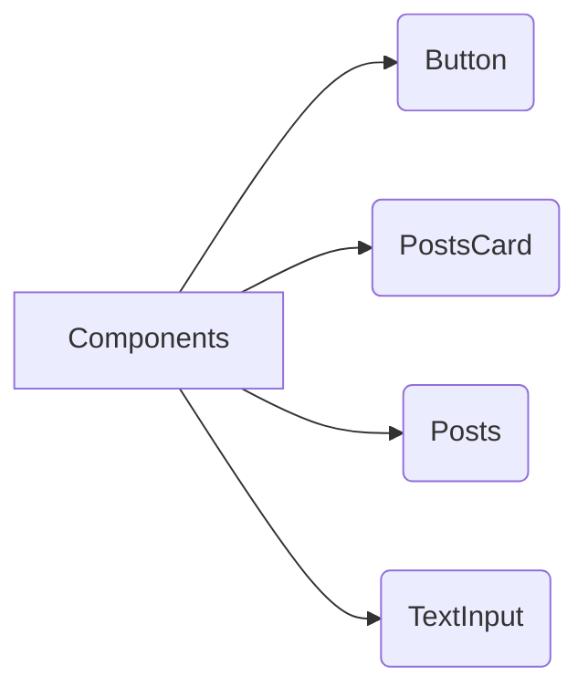
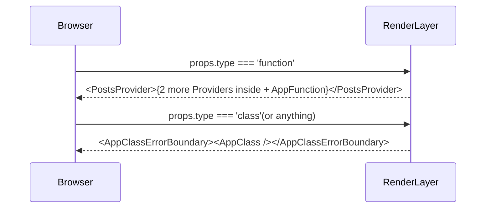

# NEXTJS AND REACT GUIDE

## v1.1.0

In these repository you'll find three main projects organized into 3 different folders: **all-important-hooks/**, **applying-all-important-hooks/**, and **project-one/**. Each section bellow contains the explanation of main concepts what i've been using on it; feel free to clone this repo and explore the features yourself. Have a nice read and play cool!

# "project-one"

First of all, install the project dependencies using `npm i` command. After that just run `npm start` to see the project working on: **http://localhost:3000/**. You will see exactly these design, click on the link to see: https://photos.app.goo.gl/zmjrJ2uZYsrG963W9

At the home page was created an "_compound react components arch_". We've a main **templates/** folder, any folder inside of it is a page. The **components/** folder has a global view of components, that can be used inside of wherever template which wants:

There are **unitary tests** implemented over each component, it doesn't affect each other:

- You can run one of the following commands to test the components on isolated mode: `npm run test-button`, `npm run test-postcard`, `npm run test-posts` or `npm run test-texting`.

> As an alternative you can run all of them integrated into a single test: `npm test`

- Also you can see the coverage report of the tests: `npm run coverage`.

The main idea of these project was create a UI for a dynamic search over items on the interface, this is fast and async as you can see when you run it; although unitary and integrated tests were implemented to guarantee a certain level of reliability and endurance. In the file **index.jsx** on the root of the project you can change the type "class" to "function" you will see a HOC changing the view from a _RCC(React Class Component)_ to a _RFC(React Functional Component)_. When you click on the "Load more posts" button, the results containing more posts will appear instantly, because all the posts were loaded before, appearing only by demand.

# "all-important-hooks"

As mentioned in the section above, install the project dependencies using `npm i` command and after just run `npm start` to see the project working on: **http://localhost:3001/**. You will see the same screen that you can see in the link: https://photos.app.goo.gl/cVDDVymYvEMykhTGA. To start our understanding about the project, go to the filepath **/src/templates/App** (remember that the compound React pattern says that all folders inside **templates/** are pages of the app); in these file you will see a _AppRouter_ functional component, it uses _React.lazy()_ concept to render the pages wrapped by a `<Suspense fallback={
Loading...
} />`, to evolve a initial render tag while the stuffs have been loading:

Continuing our understanding about the "RenderLayer" mentioned in the diagram, if the programmer pass the type prop "class" for example, he'll see a completely different UI: https://photos.app.goo.gl/k1uDNBC8VWejSMEx5

These `<AppClass>` component has an important lifecycle method to check if the counter value reached the value of 10; reaching the value the interface throws an error: _"Counter value couldn't be more than 10"_. This error is invoked on purpose, rendering another page: https://photos.app.goo.gl/LPXSvqRErxw3heaw6. Who has the responsibility to deal with errors is the **/templates/AppClassErrorBoundary/index.js**, this file has an `getDerivedStateFromError(error)` and `componentDidCatch(error, errorInfo)` to compose an **error boundary** for the AppClass component. That's why the new interface of error is generated.

And the another component to be understood is `<AppFunction />`. It's wrapped by 3 providers from the _React ContextAPI_: **PostsProvider**, **SampleProvider** and **AppFunctionStylesWrapper**, all providers are inside **/contexts** folder and has the same architecture within the same files and names, what is explained on the following diagram:

| FileName   | Functionality                                                           |
| ---------- | ----------------------------------------------------------------------- |
| actions.js | `Methods who trigger dispatches from the useReducer() hook`             |
| context.js | `Just a named const exportation of the hook createContext()`            |
| data.js    | `Named object const exportation of useReducer() initial data`           |
| index.jsx  | `Is the Provider, who uses context.js file populating the object value` |
| reducer.js | `Receive a state and an action to trigger a new value for the state`    |
| types.js   | `Typed data consts which can be used in reducer.js or action.js files`  |

To complete the understanding about these project, the **PostsProvider** exposes the <u>postsState</u> and the <u>postDispatch</u>; the state has the posts content and the dispacth method is used to dispatch an action, who triggers the posts all over the layout, see the following code to understand:

`useEffect(() => {
Actions.loadPosts(postsDispatch);
}, [postsDispatch]);`

The **SampleProvider** is the one responsible for exposing <u>sampleState</u> and <u>sampleDispatcher</u>; the state here is an object, who has the information about the light and dark theme, you can switch the theme on real time, this behavior is triggered by the dispatch, the actions "returnToOldBg"(dark) and "changeForNewBg"(light) call these dispatch and execute this action. Observe the following code see it happen:

  <code>
    

    <AppMenuProvider>
    <AppMenu  />
    </AppMenuProvider>
    

    <button
        style={{ marginRight:  '10px', background:  'blue', color:  'white' }}
        onClick={() =>  returnToOldBg(sampleDispatcher)}
    >
    Light theme
    </button>
    <button
        style={{ marginRight:  '10px', background:  'black', color:  'white' }}
        onClick={() =>  changeForNewBg(sampleDispatcher)}
    >
    Dark theme
    </button>
    .... continue
  </code>

The last provider to understand is the **AppMenuProvider**, who only wrap a single component: AppMenu. Inside of the AppMenu the <u>MenuContext</u> is used, exposing the menuDispatcher and 3 actions: changeLeftMenuItem(), changeCenterMenuItem() and changeRightMenuItem(), each action here is responsible to reverse the menu items text and gives an user alert warning. With the providers and his structures explained go into the **hooks/** folder and see the custom hooks implemented if you want.

# "applying-all-important-hooks"

All your files and folders are presented as a tree in the file explorer. You can switch from one to another by clicking a file in the tree.
