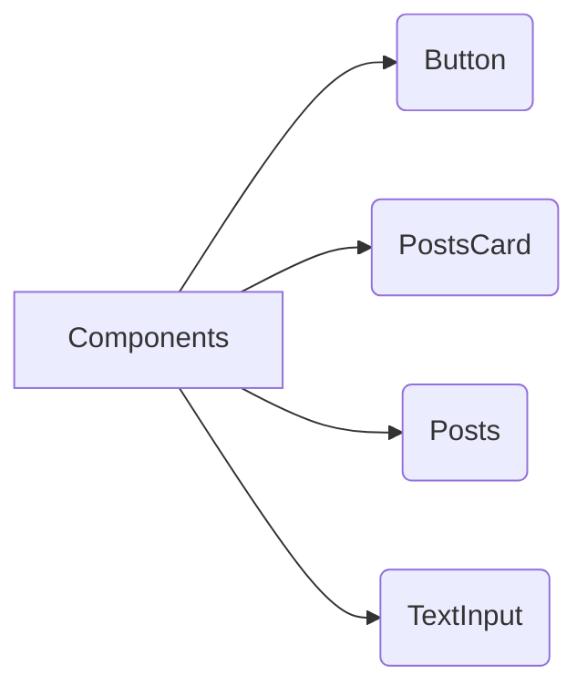
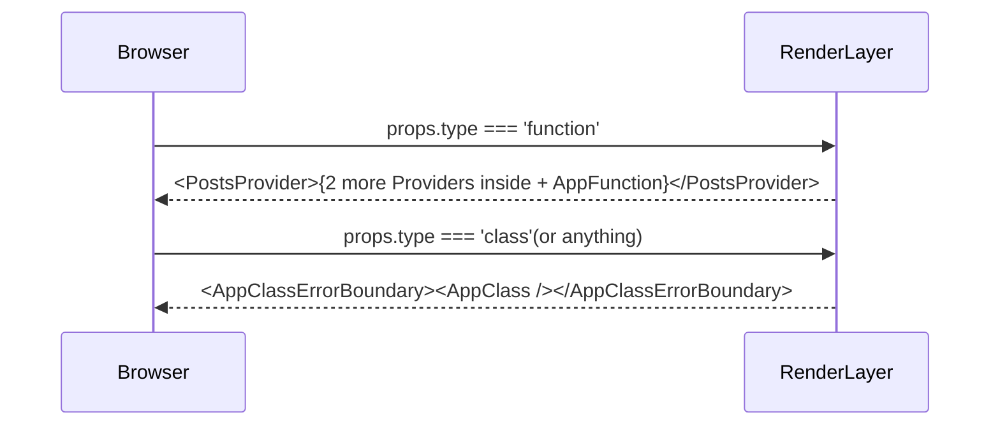

# NEXTJS AND REACT GUIDE

## v1.1.0

In these repository you'll find three main projects organized into 3 different folders: **all-important-hooks/**, **applying-all-important-hooks/**, and **project-one/**. Each section bellow contains the explanation of main concepts what i've been using on it; feel free to clone this repo and explore the features yourself. Have a nice read and play cool!

# "project-one"

First of all, install the project dependencies using `npm i` command. After that just run `npm start` to see the project working on: **http://localhost:3000/**. You will see exactly these design, click on the link to see: https://photos.app.goo.gl/zmjrJ2uZYsrG963W9
At the home page was created an "_compound react components arch_". We've a main **templates/** folder, any folder inside of it is a page. The **components/** folder has a global view of components, that can be used inside of wherever template which wants:

There are **unitary tests** implemented over each component, it doesn't affect each other:

- You can run one of the following commands to test the components on isolated mode: `npm run test-button`, `npm run test-postcard`, `npm run test-posts` or `npm run test-texting`.

  > As an alternative you can run all of them integrated into a single test: `npm test`

- Also you can see the coverage report of the tests: `npm run coverage`.

The main idea of these project was create a UI for a dynamic search over items on the interface, this is fast and async as you can see when you run it; although unitary and integrated tests were implemented to guarantee a certain level of reliability and endurance. In the file **index.jsx** on the root of the project you can change the type "class" to "function" you will see a HOC changing the view from a _RCC(React Class Component)_ to a _RFC(React Functional Component)_. When you click on the "Load more posts" button, the results containing more posts will appear instantly, because all the posts were loaded before, appearing only by demand.

# "all-important-hooks"

As mentioned in the section above, install the project dependencies using `npm i` command and after just run `npm start` to see the project working on: **http://localhost:3001/**. You will see the same screen that you can see in the link: https://photos.app.goo.gl/cVDDVymYvEMykhTGA. To start our understanding about the project, go to the filepath **/src/templates/App** (remember that the compound React pattern says that all folders inside **templates/** are pages of the app); in these file you will see a _AppRouter_ functional component, it uses _React.lazy()_ concept to render the pages wrapped by a `<Suspense fallback={
Loading...
} />`, to evolve a initial render tag while the stuffs have been loading:

